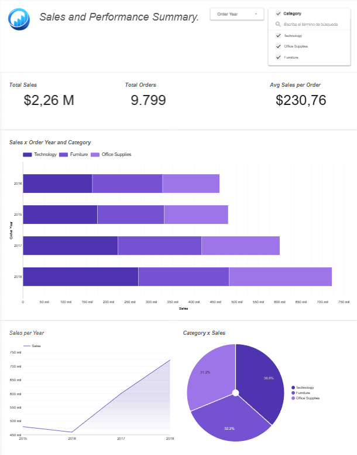
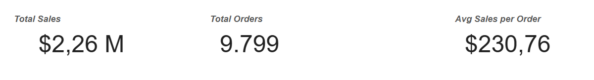
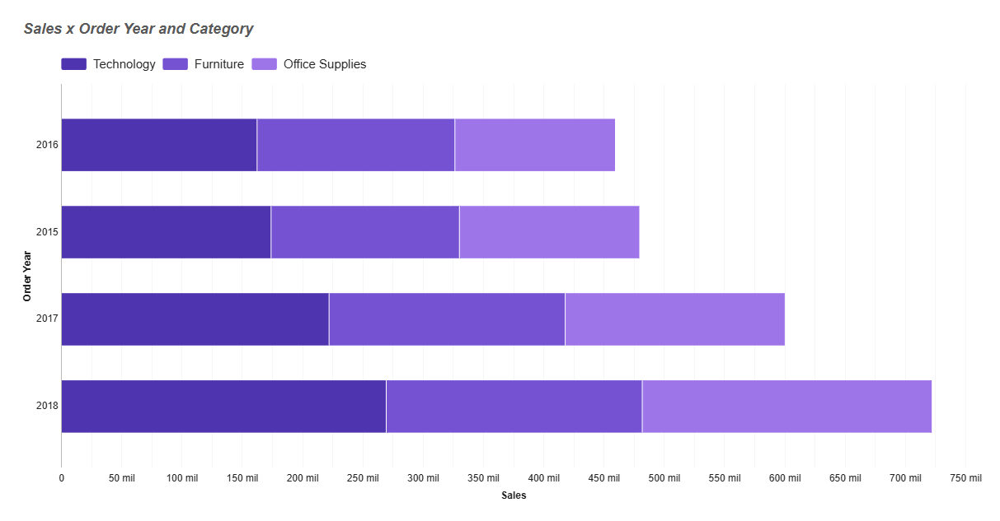
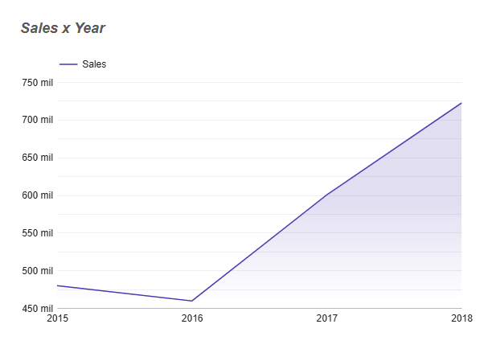

# Sales Performace Sales (2015-2018)

## Project Overview
This project analyzes historical sales data from 2015 to 2018 to understand overall sales performance, category contribution, and sales trends over time.  
The objective is to identify key patterns in revenue, order volume, and average order value using an interactive dashboard built in Looker Studio.

## Dataset
The dataset used in this project represents sales transactions and includes order dates, product categories, sales amounts, and individual orders.  
It is an educational dataset designed to simulate a real-world sales environment.

During the analysis, data quality issues were identified in the order date field, which caused aggregation errors when grouping data by year.  
To ensure stable and accurate time-based analysis, a derived field (Order Year) was created and used throughout the dashboard.

## Analysis Questions

The analysis was guided by the following business questions:

- How did total sales evolve over the years analyzed?
- Which product categories contribute the most to overall revenue?
- Is revenue growth driven by an increase in the number of orders or by higher average sales per order?

## Analysis Questions

The analysis was guided by the following business questions:

- How did total sales evolve over the years analyzed?
- Which product categories contribute the most to overall revenue?
- Is revenue growth driven by an increase in the number of orders or by higher average sales per order?

## Dashboard & Visualizations

The dashboard was designed to provide a clear and high-level view of sales performance while allowing basic exploration through filters.

The overview dashboard combines key performance indicators and visualizations to summarize overall business performance at a glance.

The KPI section highlights Total Sales, Total Orders, and Average Sales per Order, providing insight into revenue size, transaction volume, and customer purchasing behavior.

This visualization compares sales performance across product categories over time, allowing the identification of category leaders and changes in contribution by year.

The time-series chart illustrates the overall sales trend across the analyzed period, helping assess whether the business shows growth or stability over time.
